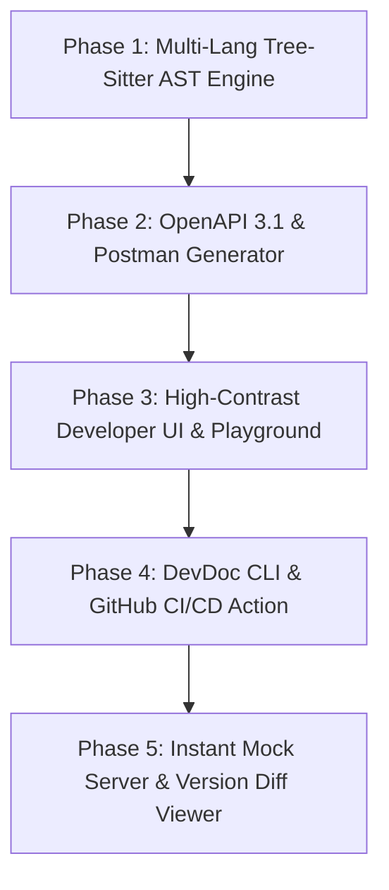

# 🚀 DevDoc AI: Million-Dollar Product Strategy & Engineering Blueprint (V1 Core + V2 AI Roadmap)

> **Strategic Directive**: Version 1 (V1) focuses 100% on **deterministic high-performance code parsing, enterprise UI/UX, zero-latency AST analysis, and essential developer tooling** without external AI/LLM dependencies. AI integration (RAG chat, LLM security auditing, AI descriptions) is strictly reserved for **Version 2 (V2)**.

---

## 🎯 Executive Vision: Capturing Backend Engineers in V1

Backend engineers value **speed, security, accuracy, low friction, and offline determinism**. They dislike slow AI hallucinations, setup complexity, and sending proprietary code to third-party APIs.

By building V1 as a **lightning-fast, 100% deterministic, local-first AST engine** with a stunning developer UI, DevDoc AI will capture backend engineers who want instant, reliable, zero-latency API documentation and tooling.

```
┌───────────────────────────────────────────────────────────────────────────┐
│                          DevDoc V1 Core Engine                            │
│ ┌───────────────────┐ ┌───────────────────┐ ┌───────────────────────────┐ │
│ │ Multi-Lang AST    │ │ Interactive UI    │ │ Developer Tools           │ │
│ │ Tree-Sitter Parser│ │ High-Contrast Portal│ │ OpenAPI 3.1 & Postman Gen │ │
│ │ (JS, Py, Go, Java)│ │ Dark-Mode First   │ │ CLI (`npx devdoc scan`)   │ │
│ └─────────┬─────────┘ └─────────┬─────────┘ └─────────────┬─────────────┘ │
└───────────┼─────────────────────┼─────────────────────────┼───────────────┘
            ▼                     ▼                         ▼
┌───────────────────────────────────────────────────────────────────────────┐
│                        V2 AI Layer (Future Upgrade)                       │
│  • LLM Synthetic Payload Gen  • AI Security Audit Agent  • Codebase RAG Chat│
└───────────────────────────────────────────────────────────────────────────┘
```

---

## 💡 1. Version 1 Core Engineering & Parser Enhancements

### 1.1 High-Performance Multi-Language AST Engine (Zero AI / 100% Deterministic)
Replace basic regex route detection with **Tree-Sitter** AST parsers to extract endpoints, path/query parameters, request bodies, and headers instantly:

- **Node.js / TypeScript**: Express (`router.post`), NestJS (`@Controller()`, `@Get()`, `@Body()`), Fastify.
- **Python**: FastAPI (extracts Pydantic `BaseModel` schemas & docstrings), Django REST Framework, Flask.
- **Go**: Gin (`r.POST("/api/v1/users", ...)`), Fiber, Echo, `net/http`.
- **Java / Kotlin**: Spring Boot (`@RestController`, `@PostMapping`, `@RequestBody`), Micronaut.

### 1.2 Schema & Type Inference Pipeline
- Automatically parse type schemas (Zod, Pydantic, TypeScript interfaces, Java DTOs) into standard JSON Schemas.
- Extract response status codes (`200 OK`, `400 Bad Request`, `401 Unauthorized`, `500 Internal Error`) directly from controller return statements and exception handlers.

### 1.3 Developer Export & Specification Engine
- **OpenAPI 3.1 & Swagger Spec**: One-click generation and validation of full `openapi.json` / `openapi.yaml`.
- **Postman Collection (v2.1)**: Instant export ready for import with auto-populated request headers and environment variables.
- **Markdown Docs (`README.md`, `API.md`)**: Beautiful, standard markdown documentation generation for repository commits.

---

## 🎨 2. UI/UX Transformation: Designing a World-Class Developer Portal

Backend engineers appreciate clean, dark-mode-first, keyboard-navigable interfaces. DevDoc AI V1 UI will deliver:

### 2.1 Developer Portal Features
- **High-Contrast Dark Mode**: Polished aesthetic built with Tailwind CSS v4, Inter typography, and sleek glassmorphism panels.
- **Interactive "Try It Out" Playground**:
  - In-browser HTTP request runner (like Swagger UI / Postman).
  - Bearer Token / API Key header state manager.
  - Formatted JSON response viewer with one-click copy and search.
- **Interactive Architecture & Route Diagrams**:
  - Auto-generate visual **Mermaid.js** architecture diagrams showing controller-to-service routing and database entity relationships (ER diagrams).
- **API Version Diff Viewer**:
  - Visual side-by-side Git-style diff showing added, modified, or deprecated endpoints between code releases.
- **Customizable Themes & Branding**:
  - Dark / Light mode toggle, custom accent colors, and custom logo upload for client-facing developer portals.

---

## 🛠️ 3. High-Value Developer Tooling & Workflow Integrations (V1)

### 3.1 DevDoc CLI (`npx devdoc scan`)
- Build a lightweight Node CLI package (`@devdoc/cli`):
  ```bash
  # Scan local repository and output openapi.json
  npx devdoc scan --out ./docs/openapi.json
  
  # Spin up local documentation UI portal at http://localhost:4000
  npx devdoc serve
  ```
- **Git Hooks**: Pre-commit hook (`husky`) integration that updates `API.md` automatically on every commit.

### 3.2 Instant Local & Hosted Mock Server
- Auto-generate a local mock server based on extracted AST schemas:
  - Responds to requests with schema-valid mock JSON data (deterministic static generator without LLM cost/latency).
  - Endpoint: `http://localhost:3000/mock/v1/:endpoint`

### 3.3 GitHub Actions & CI/CD Pipeline
- **GitHub Action Workflow**:
  - Automatically runs on `push` or `pull_request`.
  - Fails build if API breaking changes are detected without updated documentation.
  - Deploys updated docs directly to DevDoc Cloud Portal or GitHub Pages.

---

## 🔮 4. Version 2 Roadmap: AI Integration Layer

Once V1 gains traction among backend engineers through speed and reliability, V2 introduces opt-in AI features:

| V2 AI Feature | Description | Value Proposition |
| :--- | :--- | :--- |
| **AI Synthetic Payload Gen** | LLM infers realistic test data (e.g., real names, addresses) | Replaces generic `"string"` values with realistic data |
| **AI Security Audit Agent** | Scans route ASTs for missing auth middleware or unvalidated inputs | Helps backend devs identify security flaws early |
| **Codebase RAG Chat** | Vector search + LLM allows devs to ask questions about the API | Instant answer assistant for complex API integrations |
| **Natural Language Doc Generator** | Converts code comments and logic into fluent human descriptions | Saves writing tedious documentation prose |

---

## 💎 5. V1 Product Monetization & Enterprise Model

```
┌────────────────────────┐      ┌────────────────────────┐      ┌────────────────────────┐
│      Free Tier         │      │     Pro Tier ($29/m)   │      │ Enterprise ($199+/m)   │
├────────────────────────┤      ├────────────────────────┤      ├────────────────────────┤
│ • 3 Projects           │      │ • Unlimited Projects   │      │ • Everything in Pro    │
│ • Local ZIP/CLI Scan   │      │ • Hosted Dev Portal    │      │ • Custom Domains & SSO │
│ • Markdown Export      │      │ • OpenAPI & Postman    │      │ • Auto Mock Server     │
│ • OpenAPI Spec Export  │      │ • GitHub CI/CD Action  │      │ • API Diff Tracking    │
│ • Standard UI Portal   │      │ • Interactive Sandbox  │      │ • On-Prem/Docker Deploy│
└────────────────────────┘      └────────────────────────┘      └────────────────────────┘
```

---

## 📋 6. V1 Step-by-Step Implementation Roadmap for Agents



### Phase 1: Deterministic Multi-Lang AST Engine
- [ ] Integrate `tree-sitter` parsers for TS/Express/Nest, Python/FastAPI, Go/Gin, and Java/Spring Boot.
- [ ] Implement schema extractor for Pydantic, Zod, and DTO classes.

### Phase 2: OpenAPI 3.1 & Postman Exporters
- [ ] Build `OpenAPIV3Generator` service to emit standard `openapi.json` and `openapi.yaml`.
- [ ] Build `PostmanCollectionGenerator` service.

### Phase 3: Premium UI & Interactive Playground
- [ ] Redesign frontend with high-contrast Dark Mode theme.
- [ ] Implement interactive "Try It Out" HTTP runner with token management.
- [ ] Add Mermaid.js route & ER diagram visualizer.

### Phase 4: DevDoc CLI Tool & CI/CD Action
- [ ] Create `@devdoc/cli` NPM package for local scanning (`npx devdoc scan`).
- [ ] Create GitHub Action definition for automated docs generation on PR.

### Phase 5: Local Mock Server & API Diff Tracking
- [ ] Build dynamic mock server router based on JSON schemas.
- [ ] Build visual side-by-side API version diff viewer in the dashboard.
